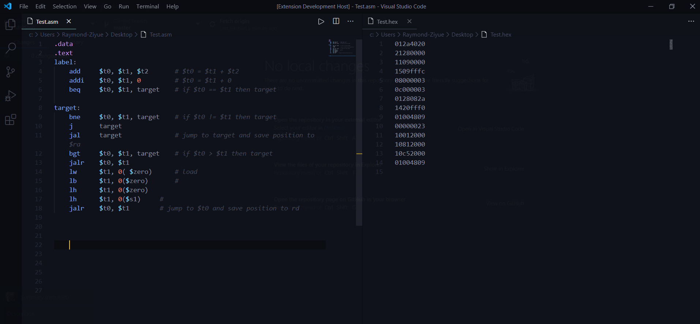
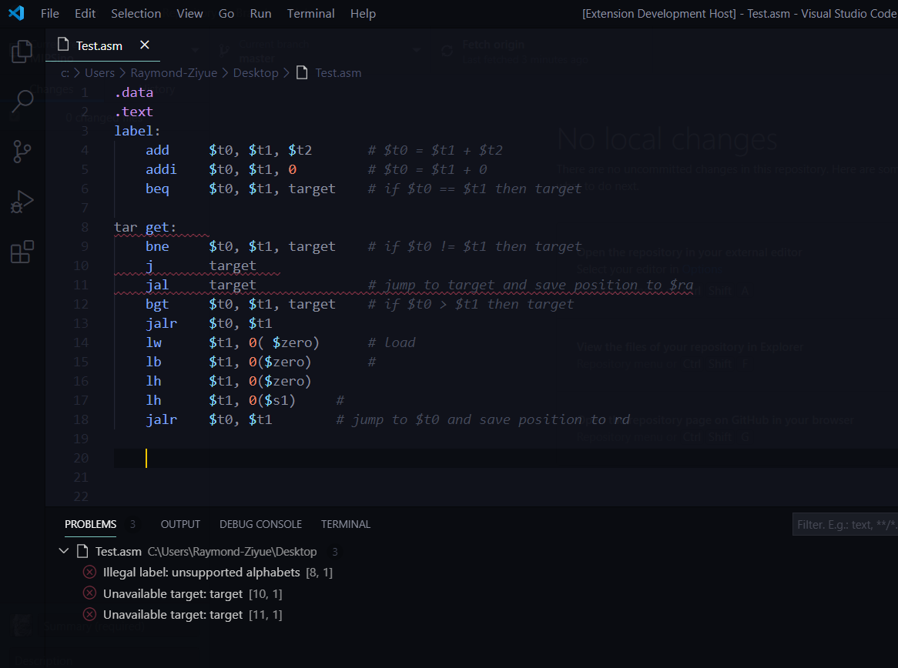
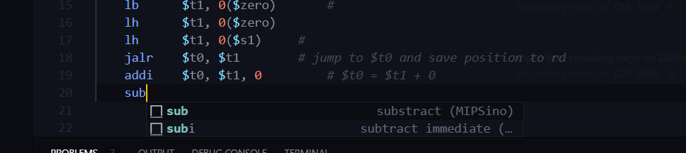
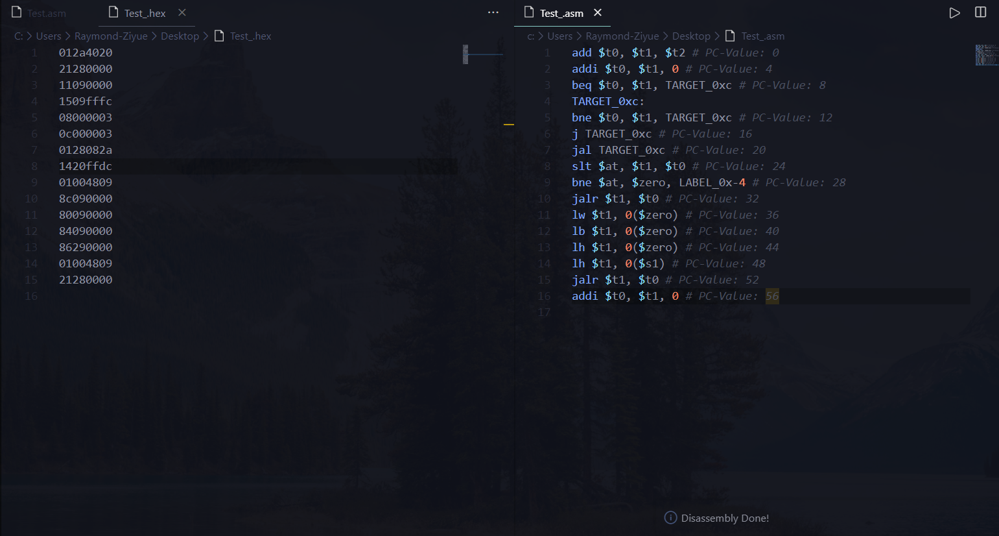

# MIPSino

**MIPSino** is a built-in vscode-extension assembler and disassembler for MIPS architecture. 

## Build

```bash
$ git clone https://github.com/PAN-Ziyue/MIPSino MIPSino
$ code ./MIPSino
$ npm install
$ start debugging in (Extension Development Host)
```

## Use

Use `Ctrl + Shift + P` open the control panel. Then select the corresponding instruction.

* Assemble
* Disassemble


## Preview:

* **interface & syntax highlighting**


* **error checking**


* **snippet**


* **disassemble**



